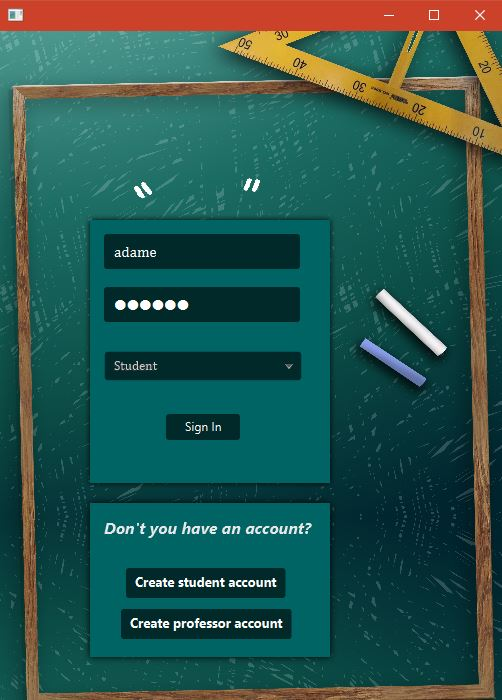
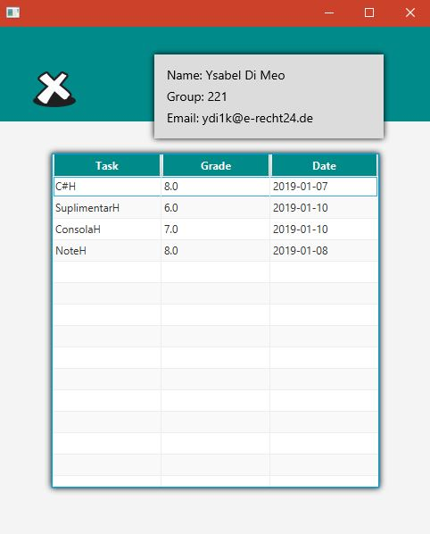
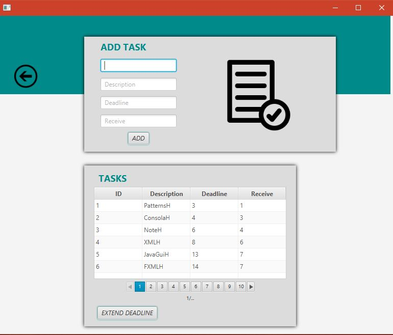
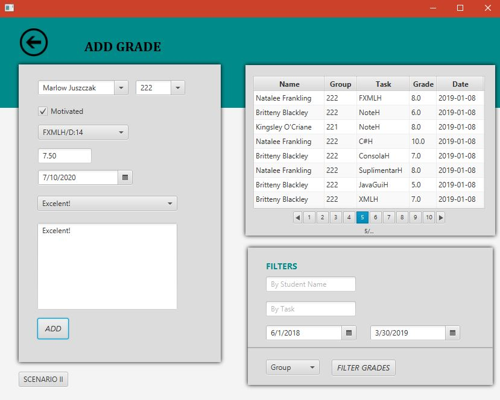
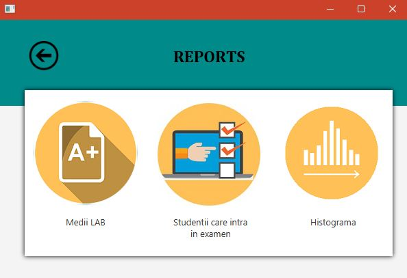
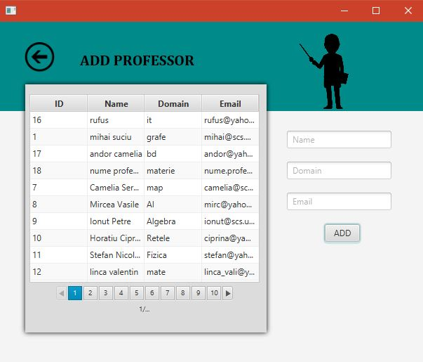
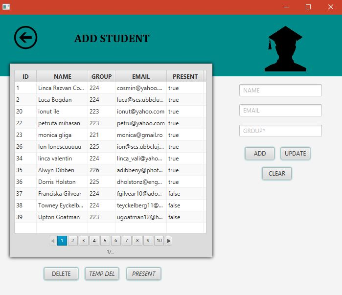

# STG ("Students | Grades | Tasks")
  
## Table of contents
* [Description](#Description)
* [Users and security](#Users/security)
* [Database](#Database)
* [Technologies](#Technologies)
* [Licence](#Licence)

# Description

The application allows the addition and management of grades together with the addition and management of student tasks, for the MAP subject, within the Faculty of mathematics and informatics, UBB Cluj.

# Users/security 

There are 3 types of users : student, profesor, admin. 
    
Account passwords are encrypted in the database using the AES algoritm (more info: https://www.tutorialspoint.com/cryptography/advanced_encryption_standard.htm)

Java packages are used: javax.crypto (https://docs.oracle.com/javase/7/docs/api/javax/crypto/package-summary.html) 
and javax.security (https://docs.oracle.com/javase/7/docs/api/javax/security/auth/package-summary.html)

# Database
  **Hibernate Framework**

  I used hibernate for the database connection with SQL Server.
  The configuration file looks like this: 
  ```xml
  <?xml version="1.0" encoding="ISO-8859-1"?>
<!DOCTYPE hibernate-configuration SYSTEM "http://www.hibernate.org/dtd/hibernate-configuration-3.0.dtd" PUBLIC "-//Hibernate/Hibernate Configuration DTD//EN">
<hibernate-configuration>
<session-factory>
<property name="hibernate.dialect"> org.hibernate.dialect.MySQLDialect </property>
<property name="connection.driver_class">com.microsoft.sqlserver.jdbc.SQLServerDriver</property>
<property name="connection.url">jdbc:sqlserver://localhost</property>
<property name="hibernate.connection.username">cos</property>
<property name="hibernate.connection.password">cos</property>
<!-- DB schema will be updated if needed -->
<property name="hibernate.hbm2ddl.auto">update</property>
<property name="show_sql">true</property>
<property name="format_sql">true</property>
<mapping class="Domain.StudentiEntity"/>
<mapping class="Domain.TemeEntity"/>
<mapping class="Domain.NoteEntity"/>
<mapping class="Domain.ProfesoriEntity"/>
<mapping class="Domain.ConturiEntity"/>
</session-factory>
</hibernate-configuration>
  
  ```

For more information I recommend the tutorial : https://www.tutorialspoint.com/hibernate/
  
# Visuals
- Login main view

 

## Student 
 

## Teacher
  

  

## Admin
   

# Technologies
  
- Java 8
- JavaFx with fxml files
- Hibernate 3.0
- SQL Server 2017, for database management

# Licence
MIT Licence
